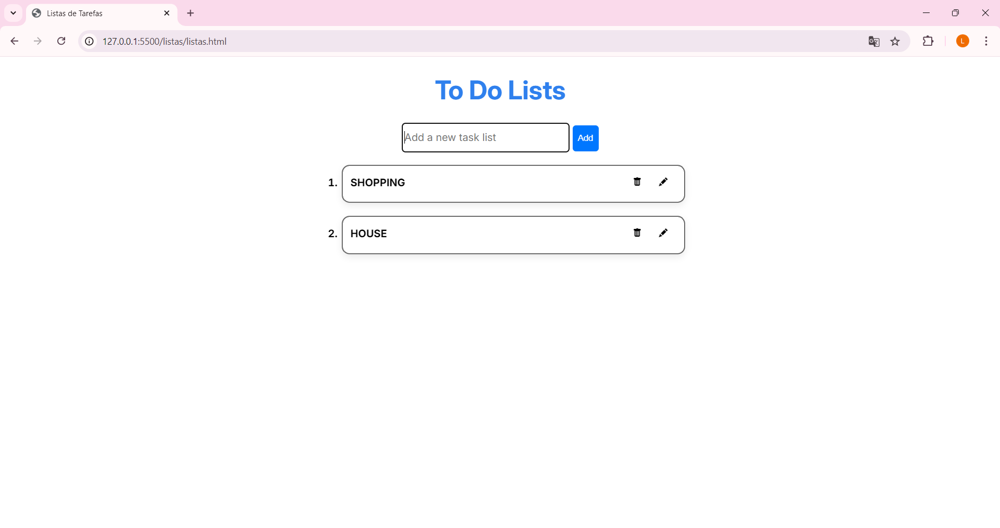
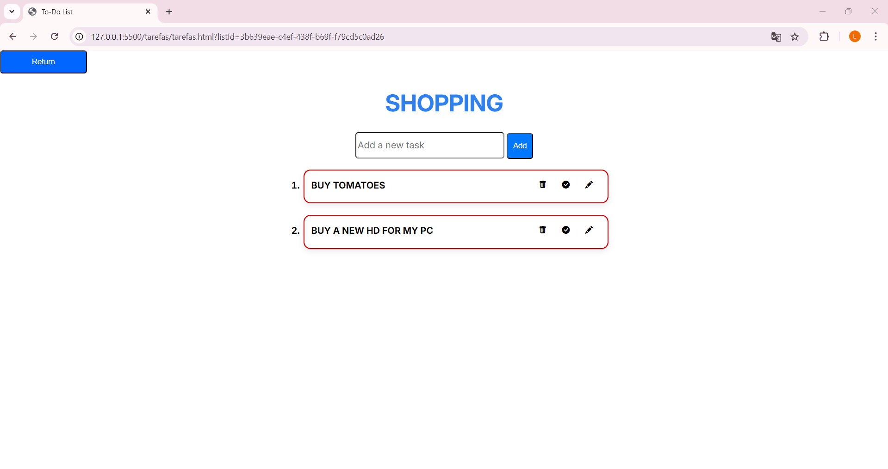

# 📝 To-Do Lists App (Multi-List)

Aplicação web de gerenciamento de tarefas com suporte a **múltiplas listas**, persistência em **LocalStorage** e interface dinâmica feita com **JavaScript puro (Vanilla JS)**.

Este projeto foi criado como prática de front-end focando em:

- Manipulação de DOM  
- Organização de dados no LocalStorage  
- Estruturação em módulos JS  
- Experiência de usuário (UX)  
- Drag and Drop nativo  

---

# 🚀 Demo

Abra o arquivo `listas/listas.html` no navegador para iniciar.

---

# ✨ Funcionalidades

## 📂 Listas

- Criar múltiplas listas de tarefas  
- Evitar listas duplicadas  
- Editar nome da lista  
- Deletar listas  
- Indicador visual de progresso da lista  
- Navegação entre listas  

---

## ✅ Tarefas

- Adicionar tarefas  
- Editar tarefas  
- Marcar como concluída  
- Deletar tarefas  
- Ordenação automática (pendentes primeiro)  
- Drag & Drop para reorganizar  
- Persistência automática no navegador  

---

# 🖥️ Interface

- Design minimalista e limpo  
- Animações suaves de entrada  
- Ícones com Bootstrap Icons  
- Fonte Inter (Google Fonts)  
- Feedback visual para tarefas concluídas  
- Efeitos hover em botões  

---

# 💾 Persistência de Dados

Os dados são armazenados localmente usando **LocalStorage**, sem backend.

---

## 📦 Estrutura de armazenamento

### Listas

```
list_key
```

Exemplo:

```json
[
  { "list_name": "Casa", "completed": false },
  { "list_name": "Trabalho", "completed": false }
]
```

---

### Tarefas

Cada lista possui sua própria chave:

```
task_key_<nomeDaLista>
```

---

# 🧠 Estrutura do Projeto

```
📁 listas
 ├── listas.html
 ├── listasScript.js
 └── listasStyle.css

📁 tarefas
 ├── tarefas.html
 ├── tarefasScript.js
 └── tarefasStyle.css

📄 list.js
📄 task.js
```

---

# 🛠 Tecnologias Utilizadas

- HTML5  
- CSS3  
- JavaScript ES6+  
- ES Modules  
- LocalStorage API  
- Drag & Drop API  
- Bootstrap Icons  
- Google Fonts  

---

## Screenshot 




---

## Para teste

[LinkTest](https://to-do-list-xse1.onrender.com)

---

# ▶️ Como Executar

## 🔹 Opção 1 — Simples

Abra:

```
listas/listas.html
```

no navegador.

---

## 🔹 Opção 2 — Live Server

1. Abra no VS Code  
2. Instale a extensão **Live Server**  
3. Clique em **Go Live**

---

# 🎯 Objetivos de Aprendizado

- Manipulação de DOM  
- Eventos JS  
- Estruturação de dados  
- Modularização de código  
- UX básica  
- Persistência local  

---

# 📜 Licença

Uso livre para estudo e aprendizado.

---

# 👨‍💻 Autor

Desenvolvido por Juan
